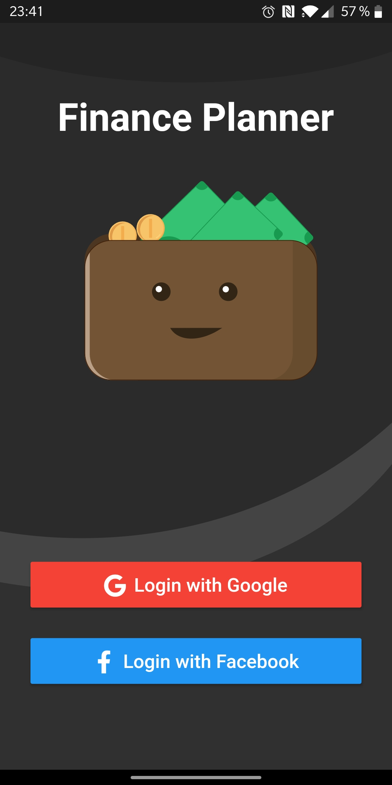
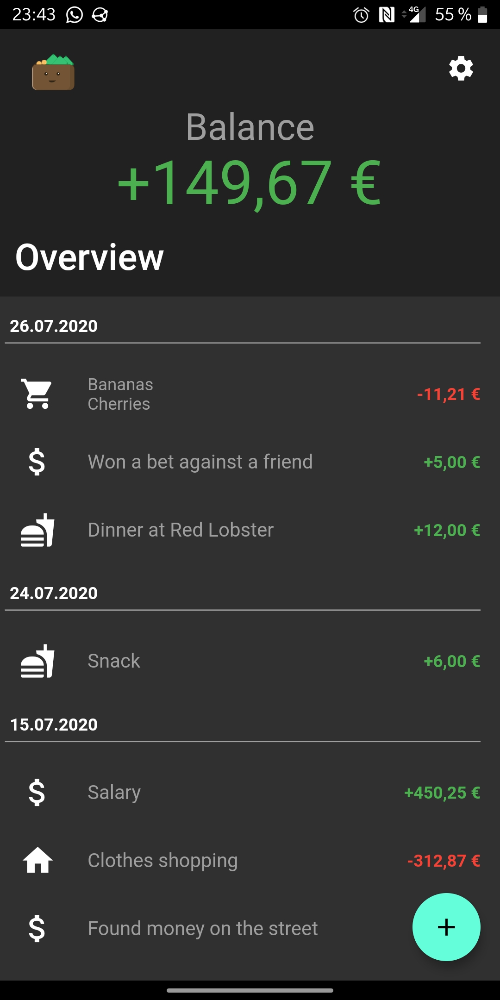
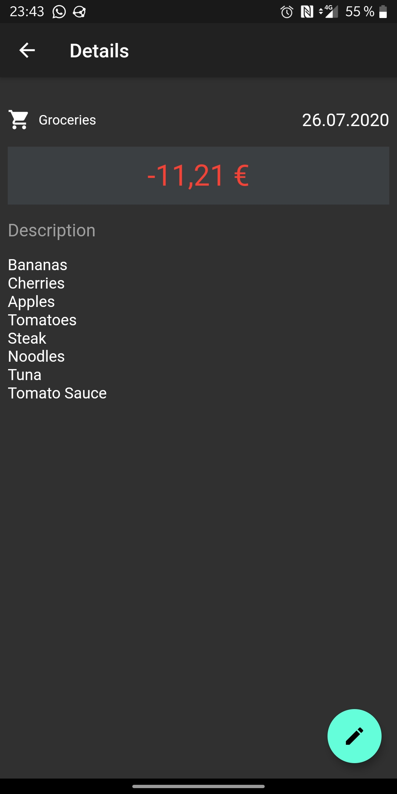
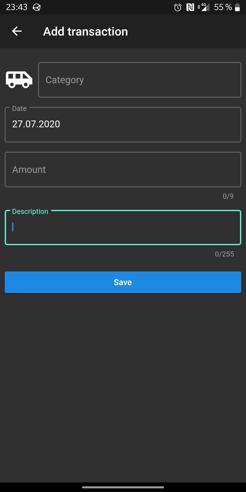
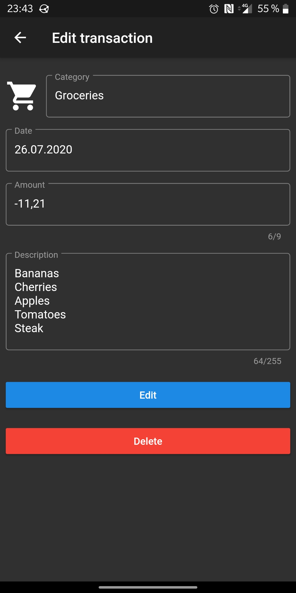

# Finance Planner

A simple app which can be used to track daily expenditures. The app provides a list of all entered transactions grouped by month.
Transactions can be assigned to categories to get a better overview over the main categories you spend money on.

## Current Features

- Social Login with Google and Facebook
- List of all transactions grouped by day
- Manage transactions (Add, View, Edit, Delete)

## Planned Features

- Provide statistics for the entered transactions

 

